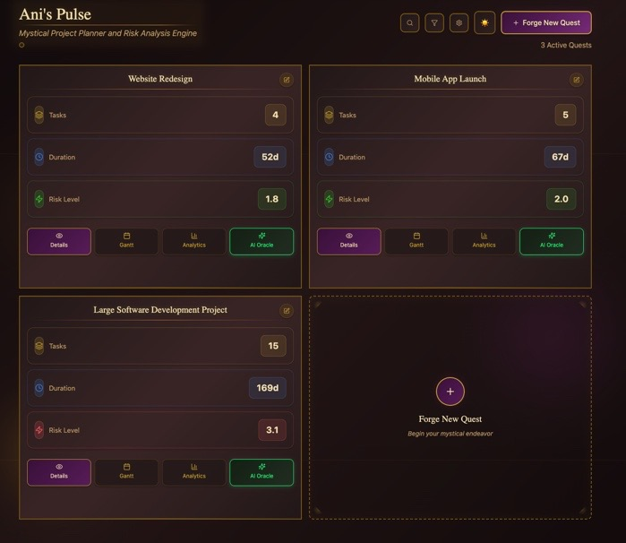
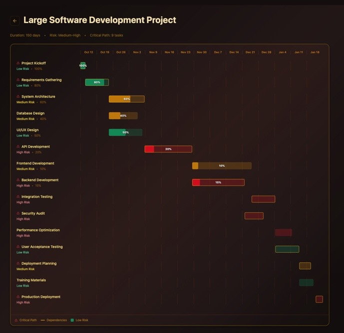
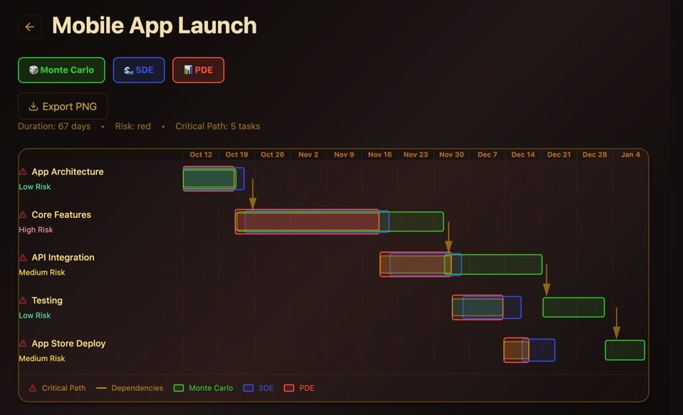

# AnisPulse - Stochastic Project Risk Analysis Platform

[](#)
[](#)
[](#)
[](#)
[](#)


<!-- index.html -->
<meta property="og:title" content="AnisPulse – Stochastic Project Risk Analysis Demo" />
<meta property="og:description" content="Interactive Gantt, risk analytics, and a clean React/TS stack." />
<meta property="og:image" content="https://YOUR_DOMAIN/social.png" />
<meta name="twitter:card" content="summary_large_image" />


> **Portfolio Demonstration** - Frontend showcase with mathematical modeling architecture



## Features Demonstrated

### Frontend Excellence
- **React/TypeScript** - Modern component architecture
- **Interactive GANTT Chart** - Custom visualization built from scratch
- **Risk Analytics Dashboard** - Complex data visualization
- **Responsive Design** - Mobile-first approach

### Mathematical Modeling (Architecture Only/Available for Demo Upon Request)
- **Foundation Engine** - Critical Path Method implementation
- **Monte Carlo Simulation** - 10,000+ iteration probabilistic analysis
- **Stochastic Differential Equations** - Continuous risk modeling
- **PDE Risk Analysis** - Dependency-based risk diffusion

## Live Demo

**Frontend:** [https://anispulse-demo.vercel.app](https://anispulse-demo.vercel.app)
**GitHub:** https://github.com/JoseMatteoChevalier/anispulse-demo

## 🎨 Features

### Interactive GANTT Chart


- Custom-built timeline visualization
- Critical path highlighting
- Risk-based color coding
- Interactive task details


*Analytics overlay toggles - Advanced features available upon request*

## Technology Stack

- **Frontend:** React 18, TypeScript, Vite, Tailwind CSS
- **Visualization:** Chart.js, Custom GANTT components
- **Backend:** FastAPI, Python (demo endpoints)
- **Mathematical Engines:** Proprietary algorithms (not included)

## 📧 Contact
Interested in the full system with advanced analytics?
- LinkedIn: [http://linkedin.com/in/josematteo](http://linkedin.com/in/josematteo)
- Email: j.e.matteo.chevalier@gmail.com

## Quick Start
```bash
# Frontend
cd frontend
npm install
npm run dev

# Backend (demo)
cd backend
pip install -r requirements.txt
uvicorn api.main:app --reload
